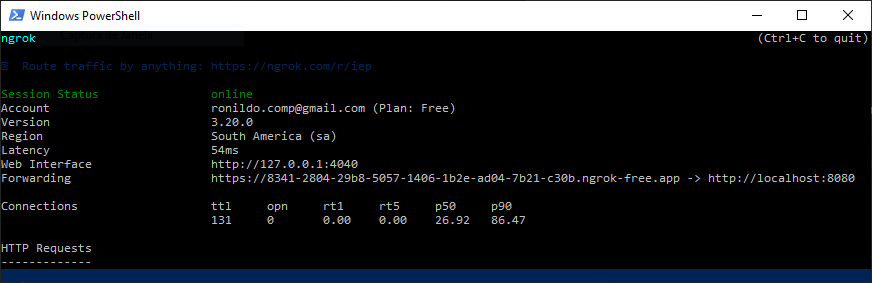
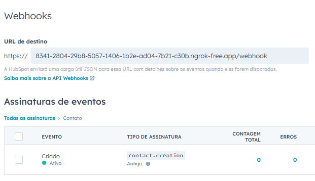
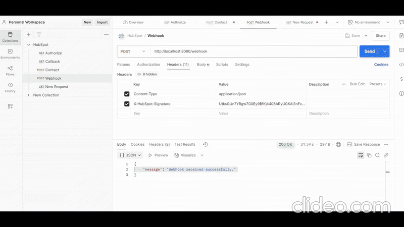

# Tech Case: HubSpot Integration API

Este é um case técnico de umaa aplicação Java utilizando Spring Boot para autenticação OAuth com o [HubSpot](https://app.hubspot.com/developer), criação de contatos e recebimento de webhooks via assinatura HMAC-SHA256.

---

## Funcionalidades

- Autenticação OAuth com o HubSpot
- Criação de contatos via API Rest
- Exposição de endpoint para Webhook
- Validação de assinatura (X-HubSpot-Signature)

---

## Tecnologias

- Java 17
- Spring Boot 3
    - Spring Web: Criação de APIs REST
    - Lombok: Reduz quantidade de escrita de código utlizando anotações
    - Spring Retry: Reexecutar chamadas com falha automaticamente (ex: erro 429)
    - SLF4J: Logging
    - HMAC-SHA256: Validação de assinatura
- Postman
- Swagger (opcional)

A aplicação construída na IDE IntelliJ usando plugins de Lint (SonarLint).

---

## Princípios de design (SOLID)

A estrutura da aplicação busca seguir os princípios do SOLID:

- **S** — *Single Responsibility*: cada classe tem uma única responsabilidade, como o `TokenService` que cuida exclusivamente da lógica de token e o `CorsConfig` que cuida de acessos à recursos.

- **O** — *Open/Closed*: componentes como o `ContactController` são abertos para extensão (como `GET /getAll`, `GET /findByID`, `DELETE /delete`, `PUT /update`), mas fechados para modificação.

- **L** — *Liskov Substitution*: interfaces e heranças podem ser aplicadas no futuro para permitir substituições sem quebrar contratos. Esse princípio se adequa bem quando essa aplicação possuir novos domínios. Por exemplo: um `ContactDTO` for uma classe-pai de uma classe com mais informações do tipo `ContactDetailedDTO` ou uma `ContactGeoDTO`, que possui dados geográficos para painéis analíticos.

- **I** — *Interface Segregation*: responsabilidades são bem separadas, evitando atributos e métodos adicionais ou genéricos em interfaces, como no `ContactDTO` que utiliza apenas no básico para a chamada da API. A mesma pode ser extendida para outros `DTOs` com domínios distintos. 

- **D** — *Dependency Inversion*: dependências como `RestTemplate` e `TokenService` são injetadas via construtor, respeitando a inversão de dependência.

---

## Como executar o projeto

1. Clone o repositório:
   ```bash
   git clone https://github.com/RonildoSilva/TechCaseHubSpotIntegration.git
   cd TechCaseHubSpotIntegration
   ```

2. Configure o arquivo `application.properties` (opcional):

   ```properties
   hubspot.client-id=<seu_client_id>
   hubspot.client-secret=<seu_client_secret>
   hubspot.redirect-uri=http://localhost:<porta>/oauth/callback
   hubspot.webhook-secret=<seu_webhook_secret>
   hubspot.oauth.uri=https://api.hubapi.com/crm/v3/objects/contacts
   ```

3. Inicie a aplicação:
   ```bash
   ./mvnw spring-boot:run
   ```

4. Para a comunicação via webhook, exponha a aplicação local com [ngrok](https://ngrok.com/):
   ```bash
   ngrok config add-authtoken <sua_chave_autenticacao>
   ```

   ```bash
   ngrok http http://localhost:8080
   ```

    

    Utilize o endereço de exposição (ou url válida) na configuração do webook.

    

    A aplicação irá rodar normalmente tanto local, quanto externamente. Existe uma configuração no `CorsConfig` que permite que qualquer endereço no formado `ngrok` funcione bem (`.allowedOriginPatterns("https://*.ngrok-free.app")`).
    Adicionalmente, dependendo da versão no `ngrok`, essa url pode mudar a cada exposição.

    5. Exemplo animado da execução do projeto:

    

---

## OAuth Authorization

- Endpoint: `GET /oauth/authorize`
- Retorna uma URL para iniciar o fluxo de autenticação OAuth no HubSpot.
    ```bash
    {
        "authorization_url": "https://app.hubspot.com/oauth/authorize?client_id=<id_cliente>&redirect_uri=http://localhost:8080/oauth/callback&scope=crm.objects.contacts.write%20crm.objects.contacts.read&response_type=code"
    }
    ```
- Recomendável utilizar no `postman` ou no navegador, pois será necessário, autenticar o usuário da conta, projeto e aplicação do Hubspot. É possível utilizar dentro do Swagger, porém dependendo do navegador e com a exposição feita pelo `ngrok` utilizando `https`, pode gerar algum conflito de protocolos de níveis de segurança diferentes.
- O retorno de sucesso da chamada será uma menssagem como:
    ```bash
    {
        "message": "Access token received."
    }
    ```
    e o `access_token` já estará sendo usado pela aplicação sem exposição alguma, garantindo maior seguraça e está implementado no `TokenService` que armazena e fornece o `access_token` do OAuth. Verifica se o token está disponível e encapsula a lógica de recuperação e revalidação quando necessário.

---

## Criação de Contato

- Endpoint: `POST /contact`
- Requer um access token OAuth válido (que já está atribudo caso a chamada `GET /oauth/authorize` tenha sido de sucesso).
- Exemplo de payload:

```json
{
  "firstname": "Bart",
  "lastname": "Simpson",
  "email": "bart.simpson@fox.com"
}
```
- Existem muito mais informações disponíveis como:
```json
{
  "email": "antunes.almeida@example.com",
  "firstname": "Antunes",
  "lastname": "Almeida",
  "phone": "+55 88 5234-3508",
  "company": "PJ",
  "website": "https://pj.com.br",
  "jobtitle": "Engenheiro de Dados",
  "city": "Quixadá",
  "state": "CE",
  "country": "Brazil",
  "lifecyclestage": "lead"
}
```
porém, é necessário apenas o nome e o email (que funciona como chave), então por questão de simplicidade, o `ContactDTO` obedeceu essa consideração e não acompanha uma classe do tipo model, pois a persistência fica na própria plataforma, assim, evita-se redundâncias.

---

## Webhook

- Endpoint: `POST /webhook`
- Valida a assinatura HMAC recebida no header `X-HubSpot-Signature`
- Exibe o conteúdo do evento recebido no log e eventos.

---

## Exemplo de evento recebido

```json
{
  "appId": 10669141,
  "eventId": 100,
  "subscriptionId": 3442836,
  "portalId": 49651156,
  "occurredAt": 1744332146137,
  "subscriptionType": "contact.creation",
  "attemptNumber": 0,
  "objectId": 123,
  "changeSource": "CRM",
  "changeFlag": "NEW"
}
```

---

## Docker
Caso queira executar a aplicação via Docker, executar o segunte comando:
    ```bash
    docker build -t hubspot-app .
    docker run -p 8080:8080 hubspot-app
    ````
# Postman
Como mencionado, é preferível utilizar o postman para tornar o fluxo de uso mais ágil. Um arquivo com o postman collection da API encontra-se na pasta: `postman_collection`
## Desenvolvedor

Desenvolvido por: Ronildo Silva.

